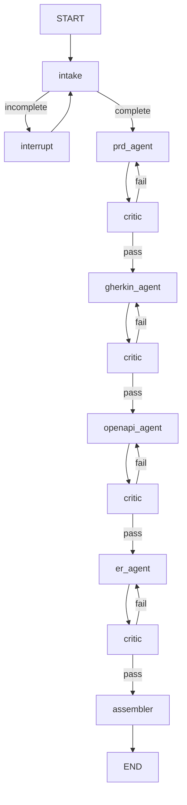

# System_Design_Agentic_Workflow

An agentic workflow that turns a rough product idea into a structured design package for a downstream coding agent.

## What This System Produces

The workflow generates four traceable artifacts:

1. Grounded PRD and feature manifest
2. Gherkin-style acceptance criteria
3. OpenAPI schema specifications
4. ER diagram schema

AsyncAPI is intentionally out of scope for the current version and may be added later for event-driven projects.

## Exact Graph Topology

The workflow is intentionally linear at the document generation layer, with a human-in-the-loop intake loop up front and a critic gate after every document.

## Node-by-Node Behavior

### `intake`

The intake node collects and refines the user's rough idea into `ClarifiedRequirements`. It uses LangGraph `interrupt()` for human-in-the-loop clarification and loops until the requirements object is complete.

### `prd_agent`

Generates the grounded PRD and feature manifest from the clarified requirements. This is the first document in the chain, so any failure here forces the workflow to restart from the upstream source rather than patching downstream artifacts in isolation.

### `gherkin_agent`

Transforms PRD features into Gherkin acceptance criteria. Each `GherkinScenario` carries `feature_ref` so scenarios trace back to the originating `Feature.id`.

### `openapi_agent`

Creates REST API contracts from the approved PRD and acceptance criteria. Each `Endpoint` also carries `feature_ref` for end-to-end traceability.

### `er_agent`

Builds the ER schema after the API contract is stabilized. The entity and relationship model is derived from the approved upstream design documents.

### `critic`

Runs after every document stage, not just once at the end. It validates only the populated state fields relevant to the current stage and writes a new `Critique` entry into `critique_history`.

### `assembler`

Serializes the final Pydantic objects into the output formats at assembly time only. Pydantic objects are converted into Markdown, Mermaid, and YAML as needed here, not earlier in the graph.

## Routing Rules

The critical routing rule is: on failure, restart from the highest upstream document that needs revision.

- If the PRD fails, re-run the full cascade: `prd_agent -> gherkin_agent -> openapi_agent -> er_agent`
- If Gherkin fails, re-run `gherkin_agent -> openapi_agent -> er_agent`
- If OpenAPI fails, re-run `openapi_agent -> er_agent`
- If ER fails, re-run `er_agent` only

This is enforced with per-document revision counters in `revision_counts`, so each artifact has its own revision budget instead of a single global counter.

## State Model

The graph state is centered on `DesignState` and tracks:

- `raw_idea`
- `intake_messages`
- `clarified_requirements`
- `prd`
- `acceptance_criteria`
- `openapi_schema`
- `er_schema`
- `critique_history`
- `revision_counts`
- `max_revisions`
- `documents_finalized`

## Implementation Notes

- `Field(description=...)` is defined on every Pydantic attribute for LLM clarity.
- `feature_ref` links keep the PRD, Gherkin, and OpenAPI layers aligned.
- Critic failures should always evaluate the latest relevant critique and the current upstream document state, not blindly rewrite everything from scratch.
- The workflow is designed to end only after the assembler has produced the final file set.
